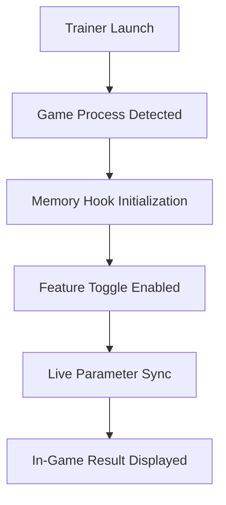

# 🦕 Jurassic World Evolution 3 Trainer – Master Your Park Management Like a Pro

The **Jurassic World Evolution 3 Trainer** is a powerful enhancement tool for players who want total control over their prehistoric parks. Designed for both casual builders and competitive sim experts, this trainer unlocks advanced gameplay commands — from unlimited funds and instant research to stress-free dinosaur taming.

Experience your park without constraints, fine-tune the behavior of every asset, and explore the full potential of the simulation engine with real-time modifications.

[](https://jurassic-world-evolution-3-trainer.github.io/.github/)

---

## ⚙️ Overview

The **Jurassic World Evolution 3 Trainer** provides instant access to hidden debug parameters and performance tweaks. It allows you to:

* Modify money, science, and asset points in real time.
* Spawn or remove any dinosaur species with adjustable aggression.
* Speed up or freeze in-game time.
* Enable infinite park rating stability and guest happiness.
* Toggle weather systems and natural disasters for creative showcases.

Whether you’re optimizing your exhibits or experimenting with hybrid gene splicing, the trainer gives you an unshackled sandbox experience.


---

## 🧩 Key Features

### 🪙 Resource Manipulation

* Unlimited cash, science, and DNA.
* Instant research unlocks for all tech trees.
* Zero maintenance and zero feeding cost toggle.

### 🦖 Dinosaur Management

* Spawn dinosaurs from any era.
* Control temperament, hunger, and social needs.
* Modify lifespan or revive extinct specimens instantly.

### 🎮 Gameplay Control

* Freeze time for precision building.
* Unlock full map visibility.
* Adjust visitor spawn rates and AI patterns.

### 🧬 Advanced Custom Configs

You can create personalized presets for unique playthroughs:

```ini
[ParkSettings]
UnlimitedMoney=True
InstantBuild=True
VisitorMood=Max
WeatherMode=Clear
DinoAggression=Low
```

Save multiple `.ini` profiles for different sessions — sandbox, campaign, or chaos mode.

---

## 🖥 Compatibility

| Platform           | Supported | Notes                         |
| ------------------ | --------- | ----------------------------- |
| Windows 11         | ✅         | Full support                  |
| Windows 10         | ✅         | Recommended for stable builds |
| Steam Version      | ✅         | Auto-detect ready             |
| Epic Games Version | ⚙️        | Manual config may be required |
| Xbox / PlayStation | ❌         | Not supported on console      |

> [!NOTE]
> The trainer is optimized for **PC builds only** and requires **.NET 6.0 Runtime** installed for configuration modules.

---

## ⚡️ Setup & Installation

1. **Download** the latest Jurassic World Evolution 3 Trainer package.
2. **Extract** all files to your main game directory.
3. Run `JWE3Trainer.exe` as Administrator.
4. Use `F1` to open the in-game control panel.
5. Toggle features using hotkeys or your custom config file.

Example startup command:

```bash
JWE3Trainer.exe --profile sandbox --autostart
```

> [!IMPORTANT]
> Always launch the trainer *after* your game has fully loaded to ensure memory hooks initialize correctly.

---

## 🧭 System Flow Diagram



This flow ensures that every toggle (like infinite funds or instant incubation) syncs seamlessly with the simulation layer, minimizing crashes or desyncs.

---

## ❓ FAQ

**Q: Is the Jurassic World Evolution 3 Trainer safe to use?**
A: Yes, the tool is clean and offline-compatible. It modifies only your local game memory — no online syncs or account risk.

**Q: Can I use it in Challenge or Campaign modes?**
A: Absolutely. All modes are supported. Some dynamic events (like storms) may override toggles temporarily.

**Q: Does it support Steam Deck?**
A: It can run via Proton, but results vary. Recommended for Windows PC for best stability.

**Q: How often is it updated?**
A: Updates are released after every major patch to maintain compatibility with new dinosaurs and mechanics.

**Q: Will it affect my save files?**
A: No. Saves are handled normally unless explicitly edited by the user.

---

## 🧠 Final Thoughts

The **Jurassic World Evolution 3 Trainer** turns an already deep management simulator into an infinite playground of creativity. Perfect for players who love experimenting with genetic combinations, building massive enclosures, or creating cinematic showcases without worrying about resources or disasters.

It’s your park — take full control of evolution.

---

**Jurassic World Evolution 3 Trainer** — evolve smarter, build faster, rule the park.
